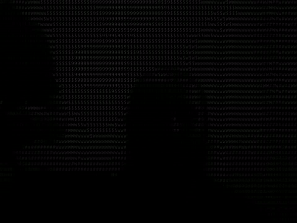

# Webcam to ASCII Converter

This project captures live video from your webcam and converts it into an ASCII art representation in real time. The program uses the `OpenCV` library for video capture and `Pillow` for image processing. The captured video is also saved as an MP4 file.

## **Overview**
The program captures webcam frames, converts each frame to grayscale, resizes the image to match ASCII character dimensions, and maps the pixel brightness to ASCII characters. The result is displayed in a window in real-time and saved as a video file.

## **Components**

### **1. Main Script (`main.py`)**
The `main.py` script performs the following tasks:
- **Webcam Capture:** Captures live video feed from the webcam using `cv2.VideoCapture`.
- **Grayscale Conversion:** Converts each frame from the webcam into grayscale to simplify the conversion into ASCII.
- **Resize for ASCII:** Resizes the frame to fit ASCII characters by scaling down the image and adjusting the height and width for character size.
- **ASCII Conversion:** Maps pixel values to corresponding ASCII characters based on their intensity (brightness).
- **Output:** Displays the ASCII representation of each frame in real-time on the screen and saves the video as `video.mp4`.

### **2. Functions**

#### **`getChar(inputInt)`**
- Converts a pixel's grayscale intensity into an ASCII character based on its brightness value. The function maps the intensity to a corresponding character from the `ASCII_chars` list, where darker pixels are represented by denser characters like `Ñ` or `@`, and lighter pixels are represented by characters like `_`.

#### **`main()`**
- The main function captures frames from the webcam, converts them into grayscale, resizes the image, and processes each pixel to create an ASCII representation.
- The frames are displayed in real-time in an OpenCV window and saved to a video file (`video.mp4`) using `cv2.VideoWriter`.
- The program continues running until the user presses the "q" key.

## **Libraries Used**
- **OpenCV (`cv2`)**: Handles webcam video capture and image processing.
- **Pillow (`PIL`)**: Used for image manipulation, including resizing and drawing text.
- **Numpy**: Used to manipulate image arrays for processing and display.

## **Gameplay Dynamics**
1. **Live Video Capture:** The program uses `cv2.VideoCapture(0)` to capture frames from the webcam.
2. **Grayscale Conversion:** Each frame is converted into grayscale, and pixel brightness values are used to select an appropriate ASCII character from the `ASCII_chars` array.
3. **Resize and Scaling:** The captured frames are resized to fit the ASCII representation, with each character's width and height adjusted for display.
4. **Real-time Display and Video Recording:** The ASCII representation of each frame is shown in a live OpenCV window and saved to a video file for later use.

---

This project demonstrates how to use the webcam for live video capture and apply image processing to convert frames into ASCII art, creating a fun and interactive way to visualize video in text form. It also offers the option to save the ASCII video as a file for future playback or sharing.
